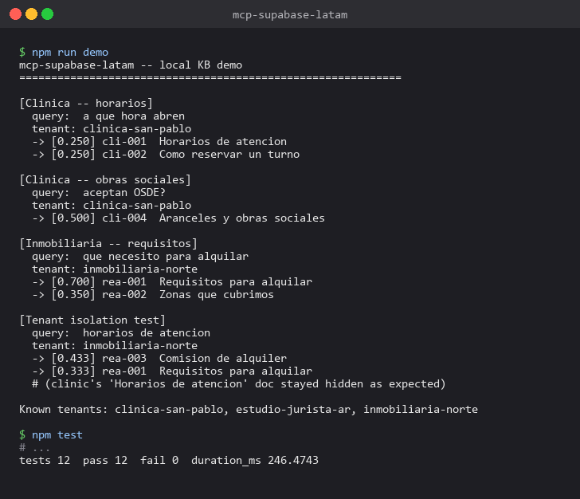
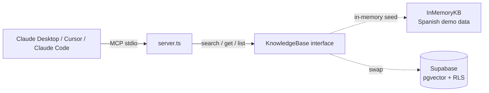

# mcp-supabase-latam

[](https://github.com/sarteta/mcp-supabase-latam/actions/workflows/tests.yml)
[](https://nodejs.org)
[](./LICENSE)

Model Context Protocol server that gives Claude (Desktop, Cursor, Claude Code) a knowledge base with **multi-tenant isolation**: tenant id is required on every search, no cross-tenant mode exists.

Ships with an in-memory seeded KB in Spanish so the server runs with zero external setup. The `KnowledgeBase` interface is around 30 lines, so swapping the implementation for Supabase pgvector (or anything else) is a contained change.





## Why multi-tenant matters

A single-tenant MCP server is fine for a developer using one knowledge base in their own Claude Desktop. It does not work for an agency serving multiple clients from the same codebase: any cross-tenant query becomes a data leak risk on a bad tool call.

This server makes tenant id mandatory on every search and document fetch. There is no list-all-documents tool because any cross-tenant enumeration is a tenant-isolation footgun if a prompt injection tricks the model into calling it.

## What it exposes

Three tools, all tenant-scoped:

| tool | purpose |
|------|---------|
| `kb_search` | Natural-language search over the tenant's KB. Returns ranked hits with title, snippet, score. |
| `kb_get_document` | Fetch one doc by id, tenant-scoped. Returns null if the doc does not exist in that tenant. Never leaks another tenant's doc. |
| `kb_list_tenants` | List known tenants. Useful for demos; in production usually disabled, with `tenant_id` coming from auth. |

## Run the demo

```bash
npm install
npm run build
npm run demo
```

Sample output (abridged):

```
[Clinica - obras sociales]
  query:  aceptan OSDE?
  tenant: clinica-san-pablo
  -> [0.500] cli-004  Aranceles y obras sociales

[Inmobiliaria - requisitos]
  query:  que necesito para alquilar
  tenant: inmobiliaria-norte
  -> [0.700] rea-001  Requisitos para alquilar
  -> [0.350] rea-002  Zonas que cubrimos

[Tenant isolation]
  query:  horarios de atencion
  tenant: inmobiliaria-norte
  -> (the clinic's 'Horarios de atencion' doc stays hidden)
```

## Wire into Claude Desktop

```bash
npm run build
```

Then in `claude_desktop_config.json` (macOS: `~/Library/Application Support/Claude/claude_desktop_config.json`, Windows: `%APPDATA%\Claude\claude_desktop_config.json`):

```json
{
  "mcpServers": {
    "supabase-latam": {
      "command": "node",
      "args": ["/absolute/path/to/mcp-supabase-latam/dist/server.js"]
    }
  }
}
```

Restart Claude Desktop. The three tools appear in the tools list.

See [`examples/claude-desktop-config.json`](./examples/claude-desktop-config.json) for a ready-to-edit sample.

## Swap the KB for Supabase pgvector

The `KnowledgeBase` interface in [`src/kb.ts`](./src/kb.ts) is:

```ts
interface KnowledgeBase {
  search(args: { query: string; tenant_id: string; limit?: number }): Promise<SearchHit[]>;
  get(args: { id: string; tenant_id: string }): Promise<Document | null>;
  listTenants(): Promise<string[]>;
}
```

Provide a Supabase-backed implementation (pgvector embedding search, SELECT filtered by `tenant_id` with RLS policies) and pass it into the server instead of `InMemoryKB`. The MCP tool handlers do not change.

## Why Spanish-by-default

Tool descriptions, error messages, schema field names matter. Claude reads tool descriptions before calling and adapts its behavior. Describing a Spanish-data KB in English produces mixed-language responses. Naming things in the target language (`aranceles`, `obra social`) helps the model anchor.

## Tests

12 unit tests covering:

- Search returns hits within the correct tenant only
- Tenant isolation: query for a concept that only exists in tenant A, asked against tenant B, returns zero hits
- Accent-insensitive matching (`horarios` matches `horarios`)
- Title matches outrank body-only matches
- `get()` returns null when tenant does not match the doc's tenant
- `listTenants` returns unique + sorted

Run with `npm test`.

## Roadmap

- [ ] Supabase adapter reference implementation (pgvector + RLS policies + migration SQL)
- [ ] Auth-context-derived tenant id (so production usage never passes `tenant_id` as a tool argument)
- [ ] Batch ingestion CLI (`mcp-supabase-latam ingest <tenant_id> <dir>`)
- [ ] Portuguese seed data (`seed-pt.ts`) for BR markets

## Design notes

- No `list_all_documents` tool. Any tool that enumerates across tenants is a tenant-isolation footgun.
- Tool descriptions name the filter requirement explicitly. Stating "filter by tenant_id, there is no cross-tenant mode" reduces the chance of a bad call.
- Stderr, not stdout, for logs. stdout is the MCP protocol channel, so `console.log` breaks the wire format. The `server.ts` comment flags this.

## License

MIT
